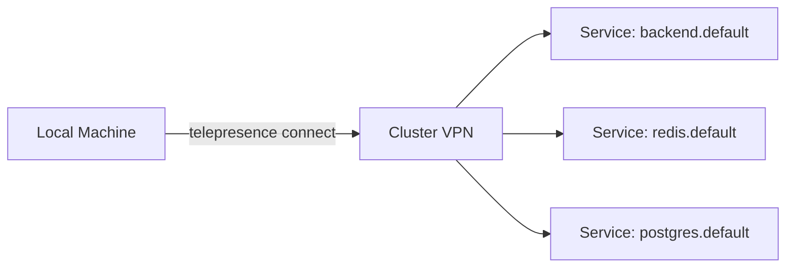

# Lab 1: The "Cluster Bridge" :bridge_at_night:

## Connectivity & DNS

!!! info "Objective"
    Verify that your local machine can **see** the cluster without an Ingress.

---

## Overview

Telepresence creates a transparent network bridge between your local machine and a remote Kubernetes cluster. Once connected, you can access cluster-internal services using their native Kubernetes DNS names — no port-forwarding, no Ingress, no NodePort hacks.



---

## Prerequisites

| Requirement | Details |
|-------------|---------|
| Telepresence CLI | Installed on your local machine |
| `kubectl` | Configured to access your remote cluster |
| Cluster | A running Kubernetes cluster (k3s, EKS, GKE, etc.) |
| Services | At least one service deployed in the cluster |

---

## Step 1: Install Telepresence CLI

=== "macOS"

    ```bash
    brew install datawire/blackbird/telepresence-oss
    ```

=== "Linux"

    ```bash
    sudo curl -fL https://app.getambassador.io/download/tel2oss/releases/download/v2.27.3/telepresence-linux-amd64 \
      -o /usr/local/bin/telepresence
    sudo chmod +x /usr/local/bin/telepresence
    ```

Verify the installation:

```bash
telepresence version
```

??? example "Expected Output"
    ```
    OSS Client : v2.27.3
    Root Daemon: not running
    User Daemon: not running
    ```

---

## Step 2: Connect to the Cluster

```bash
telepresence connect
```

??? example "Expected Output"
    ```
    ✔ Launched Daemon
    ✔ Connected to context default, namespace default
    ```

!!! warning "Kubeconfig"
    Make sure your `KUBECONFIG` environment variable points to a kubeconfig file with the **correct server IP** (not `127.0.0.1` unless the cluster is local). For remote clusters, update the `server:` field to the cluster's LAN/public IP.

---

## Step 3: Verify the Connection

Check the Telepresence status:

```bash
telepresence status
```

??? example "Expected Output"
    ```
    User Daemon: Running
    Root Daemon: Running
      Version   : v2.27.3
      DNS       : ...
      Also Proxy: ...
    ```

---

## Tasks

### Task 1: Reach an Internal Service via K8s DNS

Use `curl` to access an internal service using its full Kubernetes DNS name:

```bash
curl http://nginx.default.svc.cluster.local
```

Or the short form (within the same namespace):

```bash
curl http://nginx.default
```

!!! success "Expected Result"
    You should see the nginx welcome page HTML or whatever response the service returns — **directly from your local terminal**, without any Ingress or port-forward.

---

### Task 2: Access a Cluster-Internal Database

Deploy a Redis instance in your cluster (if not already running):

```bash
kubectl run redis --image=redis:latest --port=6379
kubectl expose pod redis --port=6379 --name=redis
```

Then connect to it directly from your local machine:

```bash
redis-cli -h redis.default
```

??? example "Expected Output"
    ```
    redis.default:6379> PING
    PONG
    ```

!!! tip "PostgreSQL Example"
    If you have a PostgreSQL service running in the cluster:
    ```bash
    psql -h postgres.default -U myuser -d mydb
    ```

---

### Task 3: Verify DNS Resolution

Confirm that your local machine resolves cluster DNS names:

```bash
nslookup nginx.default
```

Or:

```bash
dig nginx.default.svc.cluster.local
```

---

## Cleanup

When you're done, disconnect from the cluster:

```bash
telepresence quit
```

---

## Outcome

!!! success "What You Learned"
    - [x] Telepresence bridges your local network to the cluster's SDN
    - [x] You can access any cluster service using its Kubernetes DNS name
    - [x] No Ingress, NodePort, or port-forwarding is required
    - [x] Standard CLI tools (curl, redis-cli, psql) work transparently
    - [x] Your local machine behaves as if it's inside the cluster network
