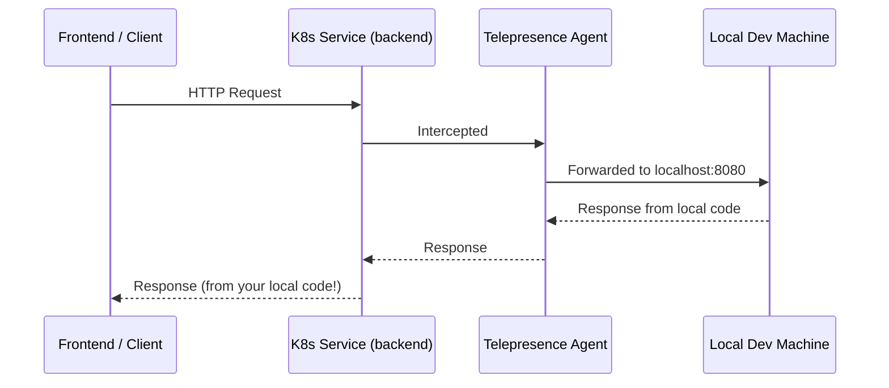

# Lab 2: The "Inner Dev Loop" :arrows_counterclockwise:

## Global Intercept

!!! info "Objective"
    Route **all traffic** from a remote service to your local code — bypass the entire CI/CD pipeline for instant iteration.

---

## Overview

A **Global Intercept** captures all incoming traffic to a service in the cluster and redirects it to a process running on your local machine. This means you can edit code locally, and see the changes reflected immediately when the service is accessed — no Docker builds, no image pushes, no `kubectl apply`.



---

## Prerequisites

| Requirement | Details |
|-------------|---------|
| Telepresence | Connected to the cluster (`telepresence connect`) |
| A deployed service | e.g., `backend` deployment with a ClusterIP service |
| Local dev environment | Your service code running locally |

---

## Step 1: Deploy a Sample Backend Service

Create a simple backend deployment and service in your cluster:

```yaml title="backend-deploy.yaml"
apiVersion: apps/v1
kind: Deployment
metadata:
  name: backend
spec:
  replicas: 1
  selector:
    matchLabels:
      app: backend
  template:
    metadata:
      labels:
        app: backend
    spec:
      containers:
      - name: backend
        image: nginx:latest
        ports:
        - containerPort: 80
---
apiVersion: v1
kind: Service
metadata:
  name: backend
spec:
  selector:
    app: backend
  ports:
    - protocol: TCP
      port: 8080
      targetPort: 80
  type: ClusterIP
```

Apply it:

```bash
kubectl apply -f backend-deploy.yaml
```

Verify:

```bash
kubectl get deploy,svc backend
```

---

## Step 2: Create a Local Application

Create a simple local Python server that will replace the cluster service:

```python title="app.py"
from http.server import HTTPServer, BaseHTTPRequestHandler
import json

class Handler(BaseHTTPRequestHandler):
    def do_GET(self):
        response = {
            "message": "Hello from LOCAL development! 🚀",
            "source": "local-machine",
            "path": self.path
        }
        self.send_response(200)
        self.send_header("Content-Type", "application/json")
        self.end_headers()
        self.wfile.write(json.dumps(response, indent=2).encode())

if __name__ == "__main__":
    server = HTTPServer(("0.0.0.0", 8080), Handler)
    print("Local server running on port 8080...")
    server.serve_forever()
```

Start the local server:

```bash
python3 app.py
```

---

## Step 3: Create the Global Intercept

In a **separate terminal**, run the intercept:

```bash
telepresence intercept backend --port 8080:8080
```

??? example "Expected Output"
    ```
    ✔ Intercepted
       Using Deployment backend
          Intercept name    : backend
          State             : ACTIVE
          Workload kind     : Deployment
          Intercepting      : all TCP connections
              8080 -> 8080 TCP
    ```

!!! note
    The `--port 8080:8080` flag means: forward cluster port `8080` to local port `8080`.

---

## Tasks

### Task 1: Verify the Intercept is Active

```bash
telepresence list
```

??? example "Expected Output"
    ```
    backend: intercepted
        Intercept name  : backend
        State           : ACTIVE
        Workload kind   : Deployment
        Intercepting    : all TCP connections
    ```

---

### Task 2: Test the Original Response

From your local machine, curl the service:

```bash
curl http://backend.default:8080
```

??? example "Expected Output"
    ```json
    {
      "message": "Hello from LOCAL development! 🚀",
      "source": "local-machine",
      "path": "/"
    }
    ```

!!! success "Key Insight"
    The response is coming from **your local Python server**, not from the nginx container in the cluster!

---

### Task 3: Modify the Code and See Instant Changes

Edit `app.py` — change the message:

```python
response = {
    "message": "Updated response - no Docker build needed! ✨",
    "source": "local-machine",
    "path": self.path
}
```

Restart your local server and curl again:

```bash
curl http://backend.default:8080
```

!!! success "Expected Result"
    You see the updated message **immediately** — without building a Docker image, pushing to a registry, or running `kubectl apply`.

---

### Task 4: Observe from the Frontend Perspective

If you have a frontend application that calls the backend service, simply refresh the browser. The frontend will receive responses from your **local code**.

---

## Cleanup

Leave the intercept:

```bash
telepresence leave backend
```

Remove the test deployment (optional):

```bash
kubectl delete -f backend-deploy.yaml
```

---

## Outcome

!!! success "What You Learned"
    - [x] A global intercept routes **all** traffic from a service to your local machine
    - [x] You can modify local code and see changes instantly in the cluster
    - [x] No Docker build, image push, or `kubectl apply` is needed during development
    - [x] The inner dev loop is reduced from minutes to seconds
    - [x] You have successfully bypassed the CI/CD pipeline for local iteration
