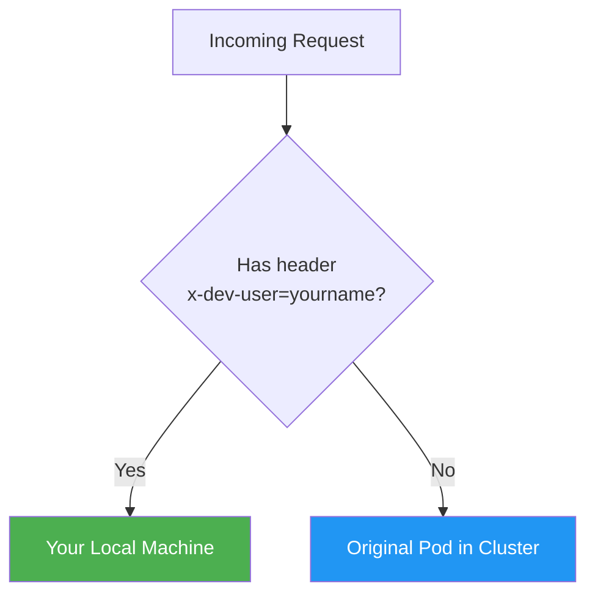

# Lab 3: The "Ghost Developer" :ghost:

## Personal Intercepts

!!! info "Objective"
    Develop in a shared environment **without affecting** other users or teammates. Only requests with your custom header hit your local machine.

---

## Overview

A **Personal Intercept** (also called a selective or header-based intercept) only routes traffic that matches a specific HTTP header to your local machine. All other traffic continues to the original pod in the cluster. This allows multiple developers to work on the same service in a shared staging/dev environment simultaneously.



---

## Prerequisites

| Requirement | Details |
|-------------|---------|
| Telepresence | Connected to the cluster |
| A deployed service | e.g., `backend` deployment with a ClusterIP service |
| Local dev environment | Your service code running locally on port 8080 |

!!! warning "Smart Agent Requirement"
    Personal intercepts require the **Telepresence Traffic Agent** to be injected into the target pod. This happens automatically when you create a personal intercept. Some older versions or configurations may require an API Gateway (like Emissary-Ingress).

---

## Step 1: Ensure the Backend Service is Running

Verify the backend deployment and service exist:

```bash
kubectl get deploy,svc backend
```

If not, deploy them using the manifest from [Lab 2](../002-inner-dev-loop/index.md).

---

## Step 2: Start Your Local Server

Use the same `app.py` from Lab 2, or create a version with your name:

```python title="app.py"
from http.server import HTTPServer, BaseHTTPRequestHandler
import json

class Handler(BaseHTTPRequestHandler):
    def do_GET(self):
        response = {
            "message": "Hello from GHOST developer! 👻",
            "developer": "yourname",
            "source": "local-machine",
            "path": self.path
        }
        self.send_response(200)
        self.send_header("Content-Type", "application/json")
        self.end_headers()
        self.wfile.write(json.dumps(response, indent=2).encode())

if __name__ == "__main__":
    server = HTTPServer(("0.0.0.0", 8080), Handler)
    print("Ghost dev server running on port 8080...")
    server.serve_forever()
```

Start it:

```bash
python3 app.py
```

---

## Step 3: Create a Personal Intercept with a Header

In a separate terminal, create the intercept with a custom header filter:

```bash
telepresence intercept backend \
  --port 8080:8080 \
  --http-header="x-dev-user=yourname"
```

??? example "Expected Output"
    ```
    ✔ Intercepted
       Using Deployment backend
          Intercept name    : backend
          State             : ACTIVE
          Workload kind     : Deployment
          Intercepting      : HTTP requests with header
              x-dev-user: yourname
              8080 -> 8080 TCP
    ```

---

## Tasks

### Task 1: Send a Standard Request (No Header)

```bash
curl http://backend.default:8080
```

!!! success "Expected Result"
    You should see the **original nginx response** from the cluster pod — your local server is NOT hit.

---

### Task 2: Send a Request with Your Custom Header

```bash
curl -H "x-dev-user: yourname" http://backend.default:8080
```

??? example "Expected Output"
    ```json
    {
      "message": "Hello from GHOST developer! 👻",
      "developer": "yourname",
      "source": "local-machine",
      "path": "/"
    }
    ```

!!! success "Key Insight"
    Only the request with the `x-dev-user: yourname` header reaches your local machine. All other traffic goes to the original pod.

---

### Task 3: Simulate Multiple Developers

Imagine your teammate creates their own intercept:

```bash
# Teammate's terminal
telepresence intercept backend \
  --port 9090:8080 \
  --http-header="x-dev-user=teammate"
```

Now three scenarios exist:

| Request | Destination |
|---------|-------------|
| `curl http://backend.default:8080` | Original cluster pod |
| `curl -H "x-dev-user: yourname" http://backend.default:8080` | Your local machine |
| `curl -H "x-dev-user: teammate" http://backend.default:8080` | Teammate's local machine |

---

### Task 4: Verify with a Browser Extension

!!! tip "Browser Testing"
    Use a browser extension like **ModHeader** (Chrome) or **Header Editor** (Firefox) to add the `x-dev-user: yourname` header to all browser requests. Then access the service URL in your browser to see your local code in action.

---

## Cleanup

Leave the intercept:

```bash
telepresence leave backend
```

---

## Outcome

!!! success "What You Learned"
    - [x] Personal intercepts route only **matching requests** to your local machine
    - [x] Other users and traffic are **unaffected** — they hit the original pod
    - [x] Multiple developers can intercept the same service simultaneously
    - [x] Custom HTTP headers act as a routing key for developer-specific traffic
    - [x] You understand how to safely "debug in production" (or staging) without causing downtime
