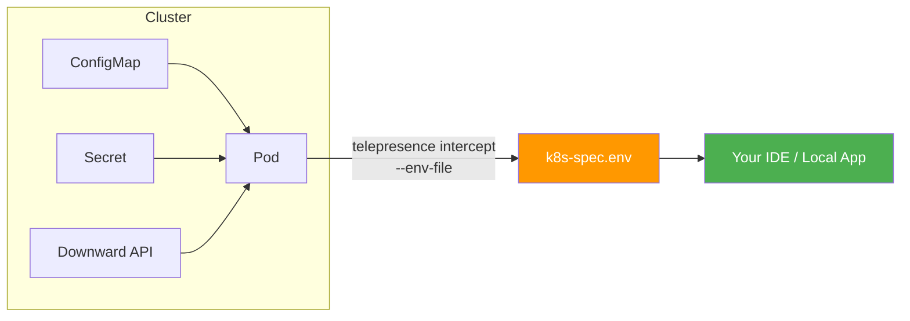

# Lab 4: The "Context Clone" :clipboard:

## Env Vars & Secrets

!!! info "Objective"
    Run your local code with the **exact same configuration** as the remote Pod — environment variables, secrets, and ConfigMap values included.

---

## Overview

One of the most common causes of "it works on my machine" issues is **missing or different configuration**. Remote pods have environment variables injected from ConfigMaps, Secrets, and the Kubernetes downward API. Telepresence can capture all of these and export them to a local `.env` file so your local application runs with identical configuration.



---

## Prerequisites

| Requirement | Details |
|-------------|---------|
| Telepresence | Connected to the cluster |
| A deployed service | With ConfigMaps and/or Secrets attached |
| Local dev environment | Your IDE or terminal |

---

## Step 1: Deploy a Backend with ConfigMaps and Secrets

Create a deployment that uses environment variables from ConfigMaps and Secrets:

```yaml title="backend-with-config.yaml"
apiVersion: v1
kind: ConfigMap
metadata:
  name: backend-config
data:
  DATABASE_HOST: "postgres.default.svc.cluster.local"
  DATABASE_PORT: "5432"
  DATABASE_NAME: "myapp"
  LOG_LEVEL: "debug"
  CACHE_TTL: "300"
---
apiVersion: v1
kind: Secret
metadata:
  name: backend-secret
type: Opaque
stringData:
  DATABASE_USER: "admin"
  DATABASE_PASSWORD: "s3cur3-p@ssw0rd"
  API_KEY: "ak_live_abc123xyz789"
---
apiVersion: apps/v1
kind: Deployment
metadata:
  name: backend
spec:
  replicas: 1
  selector:
    matchLabels:
      app: backend
  template:
    metadata:
      labels:
        app: backend
    spec:
      containers:
      - name: backend
        image: nginx:latest
        ports:
        - containerPort: 80
        envFrom:
        - configMapRef:
            name: backend-config
        - secretRef:
            name: backend-secret
        env:
        - name: POD_NAME
          valueFrom:
            fieldRef:
              fieldPath: metadata.name
        - name: POD_NAMESPACE
          valueFrom:
            fieldRef:
              fieldPath: metadata.namespace
---
apiVersion: v1
kind: Service
metadata:
  name: backend
spec:
  selector:
    app: backend
  ports:
    - protocol: TCP
      port: 8080
      targetPort: 80
  type: ClusterIP
```

Apply it:

```bash
kubectl apply -f backend-with-config.yaml
```

Verify:

```bash
kubectl get deploy,configmap,secret backend backend-config backend-secret
```

---

## Step 2: Intercept with `--env-file`

Create an intercept and export the pod's environment variables to a local file:

```bash
telepresence intercept backend \
  --port 8080:8080 \
  --env-file ./k8s-spec.env
```

??? example "Expected Output"
    ```
    ✔ Intercepted
       Using Deployment backend
          Intercept name    : backend
          State             : ACTIVE
          Workload kind     : Deployment
          Intercepting      : all TCP connections
              8080 -> 8080 TCP
          Environment file  : ./k8s-spec.env
    ```

---

## Tasks

### Task 1: Inspect the Generated Environment File

```bash
cat ./k8s-spec.env
```

??? example "Expected Output"
    ```env
    API_KEY=ak_live_abc123xyz789
    CACHE_TTL=300
    DATABASE_HOST=postgres.default.svc.cluster.local
    DATABASE_NAME=myapp
    DATABASE_PASSWORD=s3cur3-p@ssw0rd
    DATABASE_PORT=5432
    DATABASE_USER=admin
    LOG_LEVEL=debug
    POD_NAME=backend-xyz-abc
    POD_NAMESPACE=default
    KUBERNETES_SERVICE_HOST=10.43.0.1
    KUBERNETES_SERVICE_PORT=443
    ...
    ```

!!! warning "Security Note"
    The `.env` file contains **secrets in plaintext**. Add it to your `.gitignore` immediately:
    ```bash
    echo "k8s-spec.env" >> .gitignore
    ```

---

### Task 2: Use the Env File in Your Local Application

Load the environment variables when running your local server:

=== "Shell (source)"

    ```bash
    set -a && source ./k8s-spec.env && set +a
    python3 app.py
    ```

=== "Python (dotenv)"

    ```python
    from dotenv import load_dotenv
    load_dotenv("./k8s-spec.env")
    
    import os
    db_host = os.getenv("DATABASE_HOST")
    print(f"Connecting to {db_host}...")
    ```

=== "Docker"

    ```bash
    docker run --env-file ./k8s-spec.env my-app
    ```

---

### Task 3: Configure Your IDE

#### VS Code

Add a launch configuration in `.vscode/launch.json`:

```json title=".vscode/launch.json"
{
  "version": "0.2.0",
  "configurations": [
    {
      "name": "Debug with K8s Env",
      "type": "python",
      "request": "launch",
      "program": "${workspaceFolder}/app.py",
      "envFile": "${workspaceFolder}/k8s-spec.env"
    }
  ]
}
```

Now when you press ++f5++, your application starts with the **exact same environment** as the remote pod.

---

### Task 4: Verify the Configuration

Create a test script to verify all expected variables are loaded:

```python title="verify_env.py"
import os

required_vars = [
    "DATABASE_HOST",
    "DATABASE_PORT",
    "DATABASE_NAME",
    "DATABASE_USER",
    "DATABASE_PASSWORD",
    "API_KEY",
    "LOG_LEVEL",
]

print("Environment Variable Check:")
print("-" * 40)
for var in required_vars:
    value = os.getenv(var, "❌ NOT SET")
    # Mask sensitive values
    if "PASSWORD" in var or "KEY" in var:
        display = value[:3] + "***" if value != "❌ NOT SET" else value
    else:
        display = value
    print(f"  {var}: {display}")
```

Run it:

```bash
set -a && source ./k8s-spec.env && set +a
python3 verify_env.py
```

---

## Cleanup

Leave the intercept:

```bash
telepresence leave backend
```

Remove the generated env file:

```bash
rm ./k8s-spec.env
```

---

## Outcome

!!! success "What You Learned"
    - [x] Telepresence can export a pod's full environment to a local `.env` file
    - [x] ConfigMap values, Secrets, and Downward API fields are all captured
    - [x] Your IDE/debugger can load the `.env` file for identical runtime configuration
    - [x] You eliminate "it works on my machine" issues caused by missing configuration
    - [x] Always add `.env` files to `.gitignore` to prevent leaking secrets
